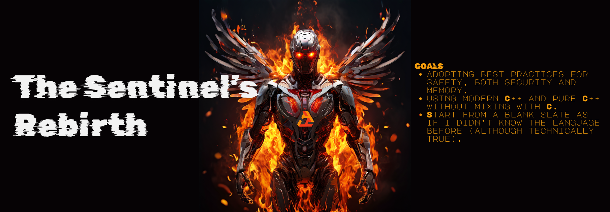

---

Hello C++, again...

```cpp
#include <iostream>

int main(){
    std::cout << "Hello World,..(but modern)" << std::endl;
    return 0;
}
```

### Will be learning with content which includes these links

- 📺 **A very good starter video(cpp-con 2023) :** [<https://youtu.be/NReDubvNjRg>]  
- 🔖 **Reference list :** [<https://cppreference.com>]  
- 🔨 **Online compiler :** [<https://compiler-explorer.com/>]  
    - **Another 1️⃣! 🔥:** [<https://compiler-explorer.com/>]  

- 📚 **Microsoft Learn:** [<https://learn.microsoft.com/cpp>]  
- 📝 **Cpp blog from Microsoft:** [<https://aka.ms/cpp>] | [<https://devblogs.microsoft.com/cppblog/>]

<br/>

###### *The list of topics is based on ...

|Topic | Completed | Comment|
|---|:---:|---|
|introduction|⭕ | |